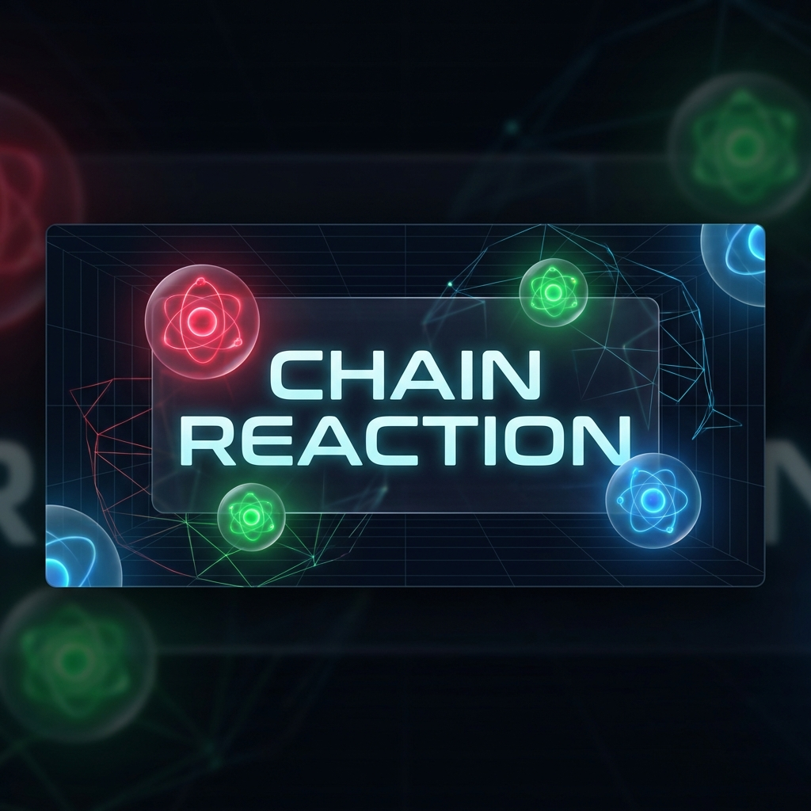

# Chain Reaction ⚛️



A strategic multiplayer game of explosive chain reactions, built with React and Firebase. Compete against friends in a battle for board domination!

## 🎮 Game Overview

Chain Reaction is a deterministic strategy game played on a rectangular grid. Players take turns placing atoms in cells. When a cell reaches critical mass, it explodes, scattering atoms to neighboring cells and claiming them for the player. The goal is to eliminate all opponents by taking over their atoms.

**Winner:** The last player standing wins the game!

## ✨ Features

- **Real-time Multiplayer**: Play with up to 4 friends seamlessly using Firebase Realtime Database.
- **Glassmorphic UI**: stunning, modern interface with neon aesthetics and blurred glass effects.
- **Responsive Design**: Fully playable on desktop, tablet, and mobile devices.
- **Dynamic Animations**: Smooth atom orbits, pulsing effects, and explosive chain reactions.
- **Lobby System**: robust lobby for joining games, setting player counts, and managing game flow.
- **Live State Sync**: Instant updates for game moves, turn switching, and player presence.

## 🛠️ Tech Stack

- **Frontend**: [React](https://react.dev/), [Vite](https://vitejs.dev/)
- **Styling**: Vanilla CSS (Variables, Flexbox/Grid, Animations)
- **Backend/Database**: [Firebase Realtime Database](https://firebase.google.com/docs/database)
- **Authentication**: [Firebase Auth](https://firebase.google.com/docs/auth) (Anonymous)
- **Font**: [Outfit](https://fonts.google.com/specimen/Outfit) & [Inter](https://fonts.google.com/specimen/Inter)

## 🚀 Getting Started

Follow these steps to run the project locally.

### Prerequisites

- Node.js (v16+)
- npm

### Installation

1.  **Clone the repository**
    ```bash
    git clone https://github.com/yourusername/chainreaction.git
    cd chainreaction
    ```

2.  **Install dependencies**
    ```bash
    npm install
    ```

3.  **Run the development server**
    ```bash
    npm run dev
    ```

4.  Open [http://localhost:5173](http://localhost:5173) in your browser.

## 📜 Game Rules

1.  **Placement**: Players take turns placing an atom in an empty cell or a cell they already own.
2.  **Critical Mass**:
    *   **Corners**: Explode at **2** atoms.
    *   **Edges**: Explode at **3** atoms.
    *   **Centers**: Explode at **4** atoms.
3.  **Explosion**: When a cell reaches critical mass, it explodes!
    *   The atoms are distributed to adjacent neighbors (up, down, left, right).
    *   Exploded atoms **convert** neighbor cells to your color.
    *   Chain reactions occur if neighbors also reach critical mass.
4.  **Elimination**: A player loses if they have no atoms left on the board.

## 📸 Screenshots

To-do

---

Built with ❤️ by [Ashin Shanly](https://github.com/ashinshanly)
